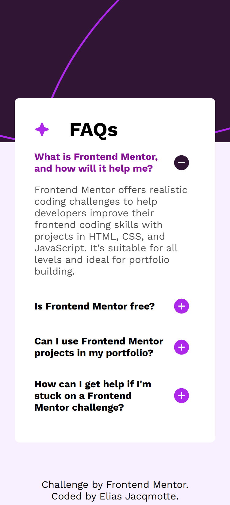

# Frontend Mentor - FAQ accordion solution

This is a solution to the [FAQ accordion challenge on Frontend Mentor](https://www.frontendmentor.io/challenges/faq-accordion-wyfFdeBwBz). Frontend Mentor challenges help you improve your coding skills by building realistic projects. 

## Table of contents

- [Overview](#overview)
  - [The challenge](#the-challenge)
  - [Screenshot](#screenshot)
  - [Links](#links)
- [My process](#my-process)
  - [Built with](#built-with)
  - [What I learned](#what-i-learned)
  - [Continued development](#continued-development)
  - [Useful resources](#useful-resources)
- [Author](#author)

**Note: Delete this note and update the table of contents based on what sections you keep.**

## Overview

### The challenge

Users should be able to:

- Hide/Show the answer to a question when the question is clicked
- Navigate the questions and hide/show answers using keyboard navigation alone
- View the optimal layout for the interface depending on their device's screen size
- See hover and focus states for all interactive elements on the page

### Screenshot

#### Mobile

#### Desktop

### Links

- Live Site URL: [Add live site URL here](https://your-live-site-url.com)

## My process

### Built with

- Semantic HTML5 markup
- CSS custom properties
- Flexbox
- CSS Grid
- Mobile-first workflow

### What I learned

- I had to lookup what the semantic HTML was for the details panel. Once i had found this implementation was easier.
- I did not know that when giving each detail the same name attribute, that when one opens, the others in the group closes.
- I had forgotten the "Vertical align" property for combining images and text together. It was also required for the element to have a width / height + aspect-ratio style. Otherwise the property did not work.
- Used some help to get animation working using [this youtube video](https://www.youtube.com/watch?v=Vzj3jSUbMtI).
- Tried implementing the + and - sign using a ::after pseudo-element. But was unable to get stacking correctly. Resorted to an image element.

### Continued development

- Something I still do not quite understand is the page would scroll if i set my body element to 100vh.
- Get the background image to work better.

### Useful resources

- [Example resource 1](https://www.youtube.com/watch?v=Vzj3jSUbMtI) - This helped me with the transition of the details panel

## Author

- Frontend Mentor - [@elias-jacqmotte](https://www.frontendmentor.io/profile/elias-jacqmotte)